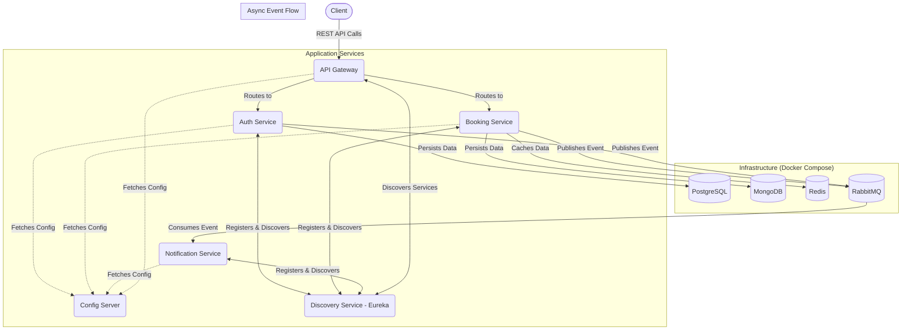

## ✈️ Ticket Reservation Microservices
A comprehensive, cloud-native microservices implementation designed to showcase a modern, event-driven architecture for a flight ticket reservation system. This project demonstrates best practices in distributed systems, including service discovery, centralized configuration, API gateways, and asynchronous communication.


### ✨ Key Features

✅ Centralized Configuration: All microservice configurations are managed by a central Spring Cloud Config Server.

✅ Service Discovery: Services register with Netflix Eureka to dynamically discover and communicate with each other.

✅ Secure API Gateway: A single entry point (Spring Cloud Gateway) for all client requests, handling routing, security, and cross-cutting concerns.

✅ JWT Authentication: Secure, stateless authentication and authorization using Spring Security and JSON Web Tokens.

✅ Event-Driven Communication: Asynchronous messaging with RabbitMQ for decoupled, resilient inter-service communication (e.g., sending notifications).

✅ Performance Caching: Redis is used as a distributed cache to optimize the performance of read-heavy operations.

✅ Polyglot Persistence: Utilizes the right database for the right job (PostgreSQL for relational auth data, MongoDB for flexible document-based booking data).

✅ Containerized Environment: The entire infrastructure is managed and run via Docker Compose, ensuring a consistent development environment.

<br>

## 🏛️ System Architecture

All external requests are routed through the API Gateway, which communicates with the downstream services. Services are registered with Eureka for discovery and fetch their configurations from the Config Server. Asynchronous tasks are delegated to a message queue.



<br>

## 🛠️ Technology Stack

| Category              | Technologies                                                                  |
|-----------------------|-------------------------------------------------------------------------------|
| **Backend** | Java 17, Spring Boot 3.x, Spring Web, Spring Data, Spring Security            |
| **Databases** | PostgreSQL, MongoDB                                                           |
| **Caching** | Redis                                                                         |
| **Messaging** | RabbitMQ                                                                      |
| **Spring Cloud** | Config Server, Netflix Eureka, Cloud Gateway, OpenFeign                       |
| **Containerization** | Docker, Docker Compose                                                        |
| **Build Tool** | Apache Maven                                                                  |

<br>

## 🚀 Getting Started

Follow these instructions to get the entire microservice ecosystem running on your local machine.

**Prerequisites:**

- Java JDK 17 or newer

- Apache Maven 3.8+

- Docker & Docker Compose

<br>

### 🐳 Local Development Environment

The entire infrastructure required for local development is managed by the `docker-compose.yml` file. This includes databases, a caching server, a message broker, and other utilities. After running `docker-compose up -d`, you can access the following services and their management UIs:

| Service         | Ports Exposed (Host)        | Management UI / Web Interface       | Credentials                                   |
|-----------------|-----------------------------|-------------------------------------|-----------------------------------------------|
| **PostgreSQL** | `5432`                      | `http://localhost:5050` (pgAdmin)   | **UI:** `pgadmin@pgadmin.org` / `admin` <br/> **DB:** `postgres` / `password` |
| **MongoDB** | `27017`                     | `http://localhost:8081` (Mongo Express)| **UI/DB:** `user` / `password`               |
| **Redis** | `6379`                      | (N/A - use tools like RedisInsight) | No password required                          |
| **RabbitMQ** | `5672` (AMQP), `15672` (UI) | `http://localhost:15672`            | `guest` / `guest`                             |
| **MailDev** | `1025` (SMTP), `1080` (UI)  | `http://localhost:1080`             | N/A                                           |

<br>

### 📋 Step-by-Step Instructions

**1. Clone the Repository**

```Bash

git clone https://github.com/arshmed/ticket-reservation-microservice.git
cd ticket-reservation-microservice

```

**2. Build All Modules**

Navigate to the root directory and run the Maven command to build all microservice JAR files.

```Bash

mvn clean install

```

**3. Launch the Infrastructure**
   
Start all the necessary infrastructure services (databases, Redis, RabbitMQ) using Docker Compose.


```Bash

docker-compose up -d

```

**4. Run the Microservices (CRITICAL ORDER)**

The services must be started in a specific order. Open a new terminal (or use the Services section on IntelliJ) for each service.

  1. Start Config Server:

```Bash

java -jar config-server/target/config-server-*.jar

```

  2. Start Discovery Service (Eureka):

```Bash

java -jar discovery-service/target/discovery-service-*.jar

```

  3. Start All Other Services:

These can be started in any order after the first two are running.

```Bash

# Terminal 3: Customer Service
java -jar api-gateway/target/customer-service-*.jar

# Terminal 4: Auth Service
java -jar auth-service/target/auth-service-*.jar

# Terminal 5: Booking Service
java -jar booking-service/target/booking-service-*.jar

# Terminal 6: API Gateway
java -jar api-gateway/target/api-gateway-*.jar

```

After a few moments, all services should be registered with Eureka and ready to serve requests. You can check the Eureka dashboard at ```http://localhost:8761```.

⚡ API Usage Flow
All requests must go through the API Gateway at http://localhost:8222.

Register a new user:
POST http://localhost:8222/api/v1/auth/register

Log in to get a JWT:
POST http://localhost:8222/api/v1/auth/login

The response will contain an accessToken.

Make authenticated requests:
Include the token in the Authorization header for all subsequent requests to protected endpoints.

Example: Get a list of flights.

``` HTTP

GET http://localhost:8222/api/v1/booking/flights
Authorization: Bearer <your_jwt_token_here>

```

The API Gateway will validate the token and route the request to the `booking-service`.
